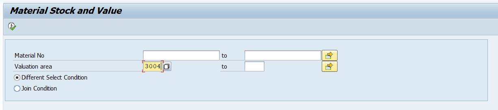
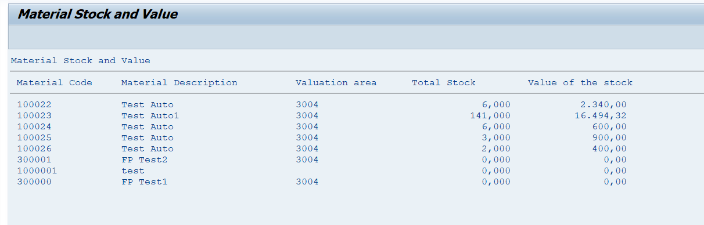
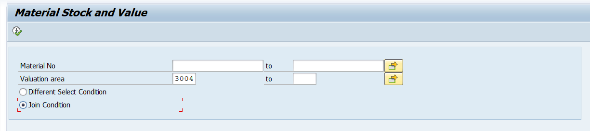
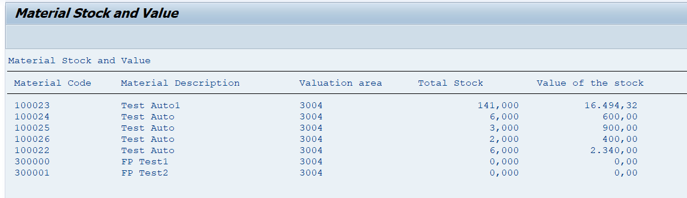

# SAP-ABAP-Projects
Welcome to my SAP ABAP project repository.
This repository contains SAP ABAP programs and projects that I have developed while learning and working on SAP ABAP on HANA.
## Technologies Used
- SAP ABAP
- Open SQL
- Internal Tables
- Work Areas
- Classical Reports
- ALV Reports
- Smart Forms
- Adobe Forms
- BDC
- BAPI
- OData
- CDS Views
- SAP HANA
- 
## Projects
### 1. Classical Report – Material Stock Report
**Description:**
Developed a classical report to display material stock details.

**Tables Used:**
- MARC
- MBEW
- MAKT
  
**Features:**
- Selection Screen
- Database Retrieval
- Internal Tables
- Report Output

## Output Screenshots

  
## About Me
I am a SAP ABAP on HANA Developer with 2+ years of experience in SAP S/4HANA development, Brownfield Conversion, ATC Remediation, RICEF Objects, CDS Views, OData, and RAP.
## Author
**Barsha Behera**
